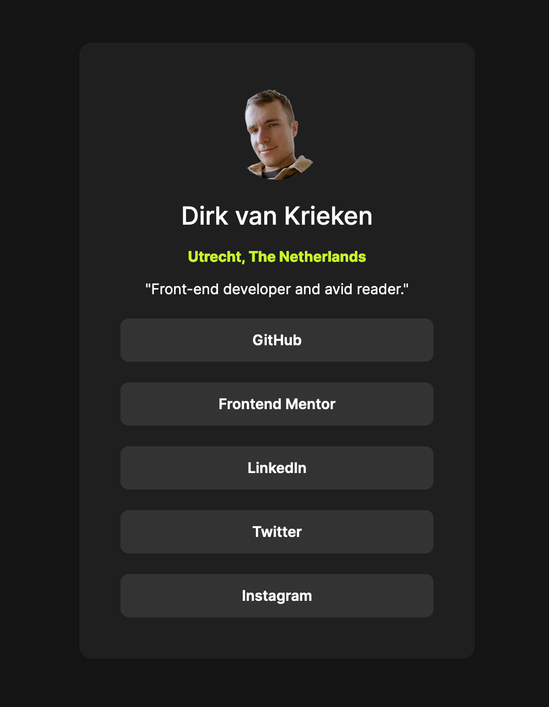

# Frontend Mentor - Social links profile solution

I did another Challenge from Front-end mentor. This time its a social links profile page, where links to my social media pages are gathered in a nice looking list.

## Table of contents

- [Overview](#overview)
  - [The challenge](#the-challenge)
  - [Screenshot](#screenshot)
  - [Links](#links)
- [My process](#my-process)
  - [Built with](#built-with)
  - [What I learned](#what-i-learned)
- [Author](#author)

## Overview
### The challenge
Users should be able to:
- See hover and focus states for all interactive elements on the page

### Screenshot

### Links

- Solution URL: [https://github.com/dirkvankrieken/dirkvankrieken.github.io](https://github.com/dirkvankrieken/dirkvankrieken.github.io)
- Live Site URL: [https://dirkvankrieken.github.io/](https://dirkvankrieken.github.io/)

## My process

### Built with

- Semantic HTML5 markup
- CSS custom properties
- Flexbox

### What I learned

Improved my skill of using Flexbox for lay-out.

## Author

- Website - [dirkvankrieken.com](https://dirkvankrieken.com)
- Frontend Mentor - [@dirkvankrieken](https://www.frontendmentor.io/profile/dirkvankrieken)

